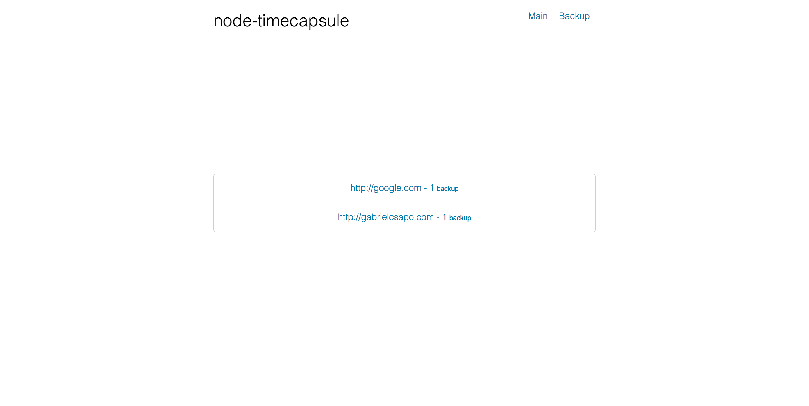
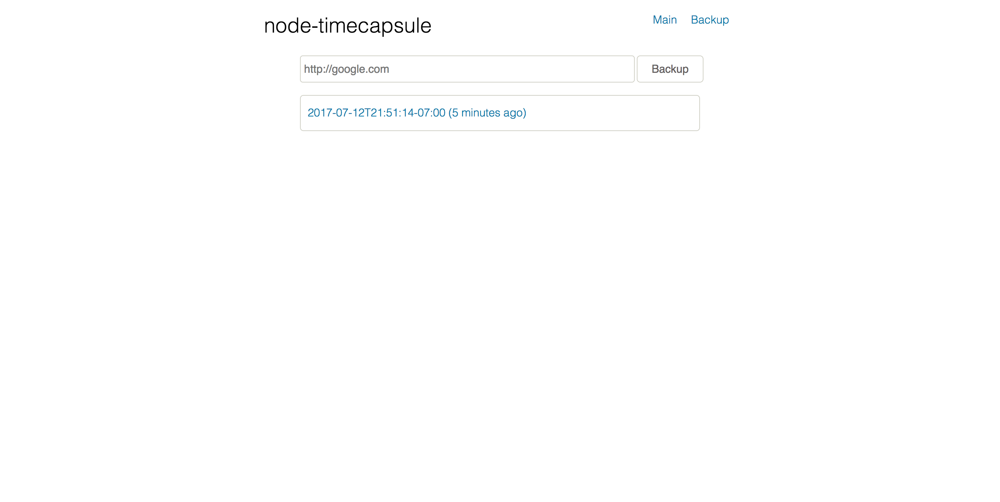

# node-timecapsule

> ⏳ saving the internet for future generations

[](https://www.npmjs.com/package/node-timecapsule)
[](https://travis-ci.org/gabrielcsapo/node-timecapsule)
[](https://starbuck.gabrielcsapo.com/github/gabrielcsapo/node-timecapsule)
[](https://starbuck.gabrielcsapo.com/github/gabrielcsapo/node-timecapsule#info=devDependencies)
[](https://github.com/gabrielcsapo/node-timecapsule)
[](https://github.com/gabrielcsapo/node-timecapsule)

# Installation

```
npm install node-timecapsule
```

# Usage

> programmatic

```javascript
const Timecapsule = require('node-timecapsule');
const timecapsule = new Timecapsule(); // you can pass a directory to the constructor if you want to specific a different directory then the default, `capsules`.

timecapsule.save('http://www.bestbuy.com', (error, result) = > {
    // will return the resources saved or an error
});
```

> shell

```
$ timecapsule save http://www.bestbuy.com
```

# Screenshots




